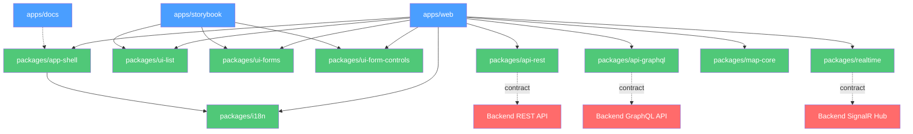

# Dependency Map

## Package Dependency Graph

## Dependency Rules

1. **Apps depend on packages** — never the reverse.
2. **Packages may depend on other packages** — but only on packages that are lower in the dependency graph.
3. **Transport packages** (`api-rest`, `api-graphql`, `realtime`) depend on backend contracts but never on UI packages.
4. **UI packages** (`ui-list`, `ui-forms`, `ui-form-controls`) never depend on transport packages.
5. **`app-shell`** may depend on `i18n` but not on UI or transport packages directly.
6. **External services** are always consumed through dedicated transport packages, never directly from apps.

## Cross-Cutting Concerns

| Concern            | Owned By              | Consumed By               |
| ------------------ | --------------------- | ------------------------- |
| Environment config | `packages/app-shell`  | All apps                  |
| Localization       | `packages/i18n`       | All apps, UI packages     |
| Test utilities     | `packages/test-utils` | All apps, all packages    |
| Quality tooling    | `tools/quality/`      | CI/CD, developer workflow |
| Release gates      | `tools/release/`      | CI/CD, promotion flow     |
