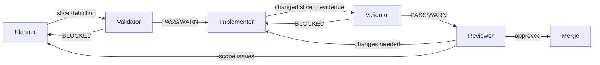

# Agent Workflow

## Overview

The WSL-AD monorepo uses a spec-driven, agent-assisted development lifecycle with four roles and explicit handoff gates.

## Roles

| Role            | Responsibility                                                               | Handoff                                                         |
| --------------- | ---------------------------------------------------------------------------- | --------------------------------------------------------------- |
| **Planner**     | Convert approved decisions into reviewable micro-tasks with scope boundaries | → Validator                                                     |
| **Implementer** | Execute one validated slice without widening scope                           | → Validator                                                     |
| **Validator**   | Challenge assumptions, gaps, bugs, missing tests, and release-risk omissions | → Reviewer (PASS/WARN) or back to Planner/Implementer (BLOCKED) |
| **Reviewer**    | Decide merge readiness for a narrow slice                                    | → Merge or back to Planner                                      |

## Workflow Sequence

## Gates

### 1. Planning Gate

Planner cannot hand off until scope, ownership, file paths, and quality impacts are explicit.

### 2. Pre-Implementation Validation Gate

Validator challenges the slice definition before implementation starts.

Run: `/speckit.validator`

### 3. Implementation Completion Gate

Implementer must provide:

- Executable validation evidence
- Docs impact assessment
- Dead-code cleanup status

### 4. Review Readiness Gate

Reviewer only sees slices that passed validator challenge or include explicit warnings with accepted follow-up actions.

## Agent Commands

| Command              | Purpose                                    |
| -------------------- | ------------------------------------------ |
| `/speckit.specify`   | Create or update feature specification     |
| `/speckit.plan`      | Generate implementation plan from spec     |
| `/speckit.tasks`     | Generate task breakdown from plan          |
| `/speckit.validator` | Challenge tasks or implementation for gaps |
| `/speckit.implement` | Execute implementation from tasks          |
| `/speckit.checklist` | Generate quality checklist                 |

## Micro-Task Rules

1. Each task must be small enough to review in a very short merge request.
2. Refactoring-only and new functional additions must be separate tasks.
3. Every task must name affected paths, owners, tests, docs, and benchmarks.
4. Every code change must validate that unused/dead code has been removed or justified.
5. A feature is not ready for merge until code, docs, translations, tests, and page objects are updated together.

## Validator Decisions

| Decision    | Meaning                          | Next Action                        |
| ----------- | -------------------------------- | ---------------------------------- |
| **PASS**    | Slice is ready to proceed        | Move to next step                  |
| **WARN**    | Issues found but not blocking    | Proceed with documented follow-ups |
| **BLOCKED** | Critical issues prevent progress | Return to Planner or Implementer   |

## Extension Hooks

The validator is wired as a mandatory pre-implementation hook via `.specify/extensions.yml`:

- **Before implement**: Validator runs automatically
- **After implement**: Validator runs optionally for post-implementation review
- **After tasks**: Validator runs optionally to challenge generated tasks
