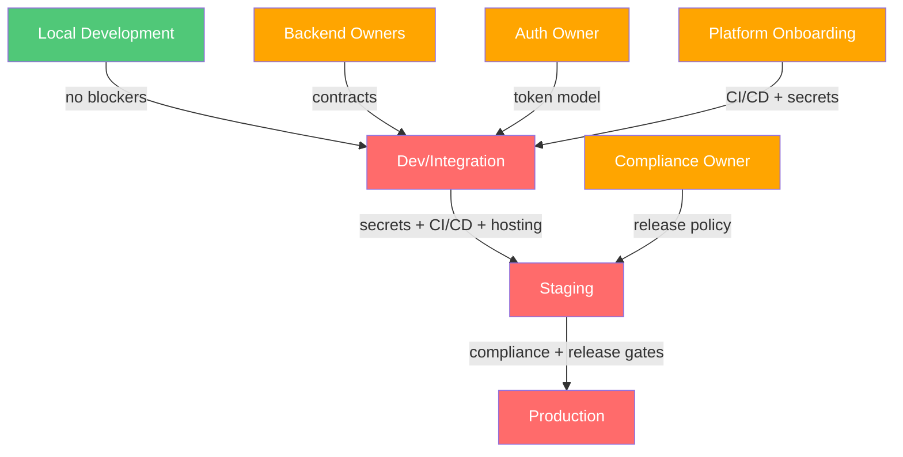

# Dependency Impact Guide

## Purpose

Document how missing platform capabilities affect delivery timelines and what breaks when dependencies are unavailable.

## Impact Matrix

| Missing Capability     | Affected Packages      | Blocked Work                                  | Severity | Mitigation                                             |
| ---------------------- | ---------------------- | --------------------------------------------- | -------- | ------------------------------------------------------ |
| Backend REST owner     | `@mono/api-rest`       | REST transport implementation                 | Critical | Name backend owner, agree on endpoint catalog          |
| Backend GraphQL owner  | `@mono/api-graphql`    | GraphQL schema codegen, client implementation | Critical | Name backend owner, deliver schema + versioning policy |
| Backend Realtime owner | `@mono/realtime`       | SignalR hub integration                       | Critical | Name backend owner, deliver hub contract               |
| Auth owner             | All transport packages | Any authenticated API call                    | Critical | Name identity provider and token model                 |
| CI/CD onboarding       | All apps               | Automated testing and deployment              | High     | Confirm platform ownership, begin pipeline setup       |
| Secrets management     | Transport packages     | Non-local API integration                     | High     | Confirm secrets system and project onboarding          |
| Compliance owner       | Release tooling        | Staging and production promotion              | High     | Name compliance owner, confirm applicable controls     |
| Observability          | `@mono/app-shell`      | Error tracking, performance monitoring        | Medium   | Confirm logging/metrics/tracing with platform team     |

## Dependency Chain

## What You Can Do Now

- All local development, scaffolding, documentation, and test infrastructure work.
- Architecture decisions, package structure, and ownership documentation.
- Benchmark harness setup and baseline recording.
- Quality tooling and release gate definitions.

## What Requires External Resolution

- Any transport package implementation beyond contract placeholder modules.
- Any environment-specific configuration with real endpoints.
- Any CI/CD pipeline execution or deployment.
- Any staging or production release planning.
