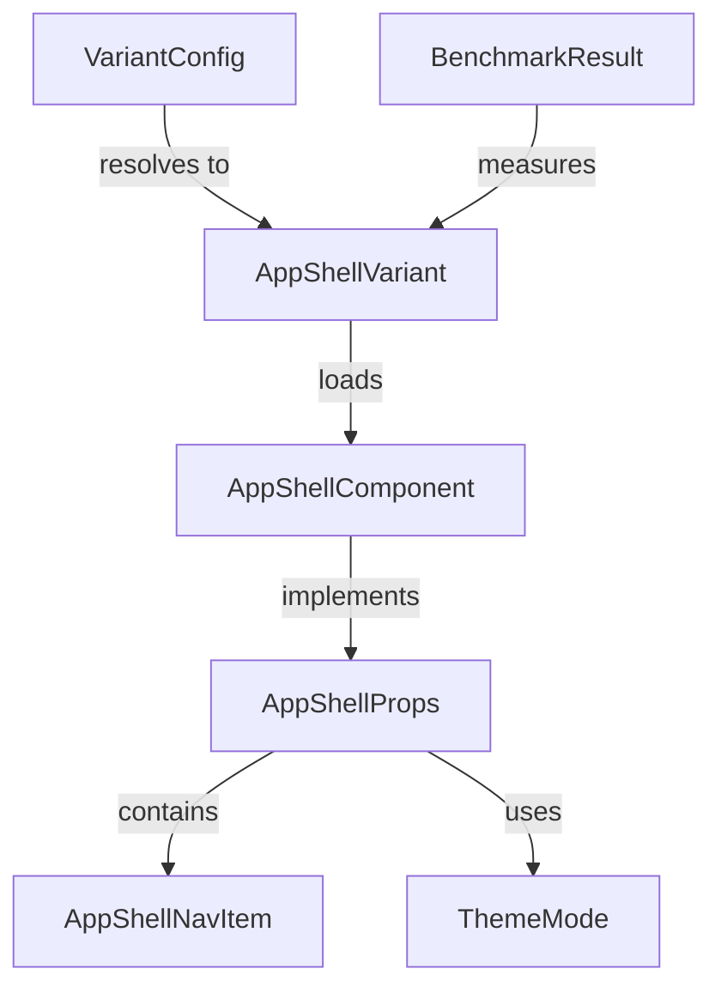

# Data Model: App Shell UI Framework Benchmark

**Created**: 2026-05-31
**Feature**: [spec.md](./spec.md)

## Entities

### AppShellVariant

Identifies which UI framework implementation to load.

| Field | Type | Constraints |
|-------|------|-------------|
| id | `'mui' \| 'mantine' \| 'radix' \| 'lit'` | Required, one of 4 values |

**Validation**: Must be one of the 4 allowed string literals. Invalid values fall back to env default or `'mui'`.

---

### AppShellNavItem

A navigation item rendered in the sidebar.

| Field | Type | Constraints |
|-------|------|-------------|
| id | string | Required, unique |
| label | string | Required (used for tooltip/aria-label) |
| icon | `ComponentType` | Required, a React component rendering an icon |

---

### AppShellProps

The shared component interface all variants implement.

| Field | Type | Constraints |
|-------|------|-------------|
| logo | `ComponentType` | Required |
| navItems | `AppShellNavItem[]` | Required, min 1 item |
| themeMode | `'light' \| 'dark'` | Required |
| onThemeToggle | `() => void` | Required |
| children | `ReactNode` | Optional |

---

### ThemeMode

| Value | Description |
|-------|-------------|
| `'light'` | Light color scheme |
| `'dark'` | Dark color scheme |

**State transitions**: `light` ↔ `dark` (toggled by user clicking theme button in top bar).

---

### BenchmarkResult

A recorded measurement for one variant across one scoring dimension.

| Field | Type | Constraints |
|-------|------|-------------|
| variant | `AppShellVariant['id']` | Required |
| dimension | `'agent-implementation' \| 'agent-docs-tests' \| 'performance'` | Required |
| score | number | Required, 1–10 for agent dimensions; raw metric for performance |
| metrics | `Record<string, number \| string>` | Optional, detailed sub-metrics |
| notes | string | Required for agent dimensions (qualitative notes) |

**Sub-metrics for performance dimension**:
- `lighthouseScore`: number (0–100)
- `bundleSizeGzipped`: string (e.g., "45kB")
- `buildTimeMs`: number
- `fcpMs`: number (First Contentful Paint)
- `lcpMs`: number (Largest Contentful Paint)
- `themeToggleMs`: number

---

### VariantConfig

Runtime configuration for variant selection.

| Field | Type | Source |
|-------|------|--------|
| queryParam | `string \| null` | `?ui=` from URL |
| envDefault | `AppShellVariant['id']` | `VITE_UI_VARIANT` from `.env` |
| hardcodedFallback | `'mui'` | Constant |

**Resolution order**: queryParam → envDefault → hardcodedFallback

## Relationships

